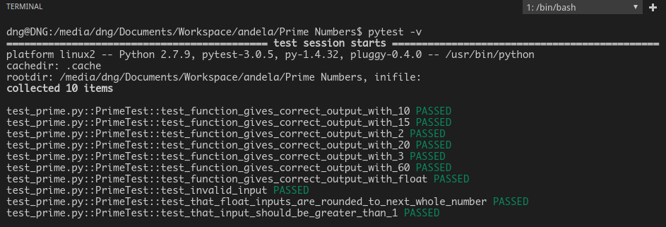
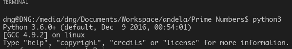
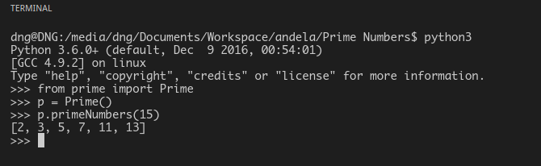

# PRIME NUMBERS

This is a function that uses the trial division algorithim to determine the primality of a given number.

## GETTING STARTED

On your terminal run the following command

`git clone https://github.com/andela-gathondu/Prime-Numbers.git`

## PREREQUISITES

You should have python installed in your machine.
If you dont have python installed go to this link
    [Installing Python.](https://tutorial.djangogirls.org/en/python_installation/)

You should also have pytest installed if not follow this link
[Installing pytest.](http://docs.pytest.org/en/latest/getting-started.html)

## Running the test

1. Open your terminal and go to the directory where you have the project cloned.

2. On the terminal run this command `pytest -v` and you should notice that all defined tests pass and an output

   as follows should appear.

    

3. To try out the program on the console, got tp the terminal still inside the projects' folder and

   follow the process below.

    * type `python` on the and hit `enter` key and the following will be displayed depending on your python installation
    

    * from there import the `Prime` class using this command `from prime import Prime`

    * Now you can create an instance of the class and use the `primeNumbers()` method to get a list of the prime Numbers as shown below.

      

## Built With

* [visual studio code](https://code.visualstudio.com/)
* [python 3.6](https://www.python.org/downloads/)